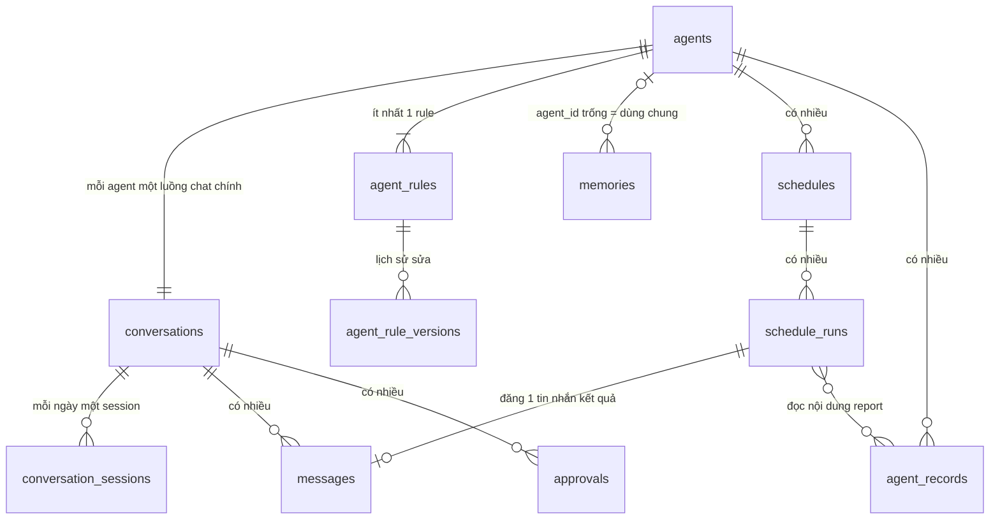

# Database — thiết kế và dữ liệu mẫu

> Tài liệu đi kèm `IDEAS.md`. Đây là bản nháp ở mức ý tưởng: tên bảng và các cột chính. Kiểu dữ liệu chi tiết, index, ràng buộc sẽ chốt khi code.
> Trong dữ liệu mẫu, id viết ngắn (`ag_mail`, `cv_mail`…) cho dễ đọc. Thực tế dùng UUID.

## 1. Sơ đồ quan hệ



Ba bảng đứng độc lập: `contacts`, `integrations`, `push_subscriptions`.

Đọc sơ đồ:
- Mỗi **agent** có **ít nhất một rule** (`agent_rules`). Mỗi lần sửa rule được lưu lại trong `agent_rule_versions`.
- Mỗi **agent** có **một luồng chat chính** (`conversations`). Giao diện hiển thị luồng này liên tục.
- Bên dưới, luồng chat được chia thành các **session theo ngày** (`conversation_sessions`) để model không phải mang theo toàn bộ lịch sử.
- Mỗi **lần chạy lịch** (`schedule_runs`) đọc dữ liệu đã lưu (`agent_records`, ví dụ nội dung report), làm việc ở chế độ nền, rồi **đăng một tin nhắn kết quả** vào luồng chat của agent.

## 2. Các bảng và cột chính

### `agents` — danh sách agent
| Cột | Ý nghĩa |
|---|---|
| id | Mã agent |
| slug | Tên ngắn, không dấu: `general`, `mail-action` |
| name | Tên hiển thị |
| description | Mô tả ngắn. Chat chung đọc cái này để gợi ý agent |
| instructions | Hướng dẫn chung của agent: vai trò, phạm vi, cách làm việc. Sửa được trên giao diện |
| capabilities | Việc làm được và không làm được (JSON) |
| tools | Danh sách tool được cấp |
| skills | Danh sách skill được cấp (tên skill, ví dụ `daily-report`). Nội dung skill là file trong code backend, không lưu trong DB |
| model | Model dùng cho agent này |
| is_default | `true` với chat chung |
| icon, color | Tuỳ chọn, để phân biệt trên sidebar |
| enabled, sort_order | Bật/tắt, thứ tự trên sidebar |
| created_at, deleted_at | Thời gian tạo, xoá mềm. `general` không xoá được |

### `conversations` — luồng chat
| Cột | Ý nghĩa |
|---|---|
| id | Mã luồng chat |
| agent_id | Thuộc agent nào. **Mỗi agent một luồng chính** |
| current_session_id | Session SDK đang dùng (của hôm nay) |
| last_message_at | Tin nhắn cuối, để sắp xếp sidebar |
| unread_count | Số tin chưa đọc, ví dụ tin kết quả lúc 7h |

### `conversation_sessions` — session SDK theo ngày
| Cột | Ý nghĩa |
|---|---|
| id | Mã |
| conversation_id | Thuộc luồng chat nào |
| sdk_session_id | Mã session của Agent SDK, dùng để `resume` |
| date | Ngày của session |
| summary | Bản tóm tắt ngày đó, viết khi hết ngày hoặc khi chuyển session |
| started_at, ended_at | Thời gian |

### `messages` — toàn bộ tin nhắn (kho lưu trữ)
| Cột | Ý nghĩa |
|---|---|
| id | Mã tin nhắn |
| conversation_id | Thuộc luồng chat nào |
| session_id | Thuộc session nào (trống với tin sự kiện) |
| role | `user`, `assistant`, `tool`, hoặc **`event`** (tin do job/lịch đăng vào, ví dụ "✅ Đã gửi daily report") |
| content | Nội dung (JSON): chữ, tool đã gọi, kết quả tool, hoặc thẻ kết quả |
| schedule_run_id | Có giá trị nếu tin nhắn do một lần chạy lịch đăng vào |
| search_text | Bản chữ thuần để tìm kiếm (full-text search) |
| input_tokens, output_tokens, cache_read_tokens | Token của lượt đó (chỉ có ở tin `assistant`) |
| cost_usd | Chi phí của lượt đó |
| created_at | Thời gian |

### `agent_rules` — rule của agent
| Cột | Ý nghĩa |
|---|---|
| id | Mã rule |
| agent_id | Của agent nào |
| scope | `all` (mọi việc của agent) hoặc tên việc cụ thể: `daily-report`, `weekly-report`, `send_email`… |
| title | Tên ngắn, ví dụ "Chữ ký", "Format daily". Không đặt người nhận trong rule (người nhận nằm trong tin nhắn hoặc cấu hình lịch) |
| content | Nội dung rule bằng lời (format, cấu trúc, văn phong, chữ ký…), đưa vào ngữ cảnh cho model |
| enabled | Bật/tắt mà không cần xoá |
| version | Số phiên bản hiện tại |
| created_at, updated_at, deleted_at | Thời gian. Xoá mềm |

Mỗi agent phải có **ít nhất 1 rule đang bật**. Backend không cho xoá hoặc tắt rule cuối cùng.

Không có cột ưu tiên. Khi hai rule mâu thuẫn thì **rule theo việc thắng rule `all`**. Hai rule cùng phạm vi mâu thuẫn nhau thì giao diện cảnh báo để người dùng sửa, không để máy tự chọn.

### `agent_rule_versions` — lịch sử sửa rule
| Cột | Ý nghĩa |
|---|---|
| id | Mã |
| rule_id | Rule nào |
| version | Phiên bản |
| snapshot | Toàn bộ nội dung rule ở phiên bản đó (JSON) |
| changed_by | `user_ui` (sửa trên tab Rule) hoặc `user_chat` (nhắn cho agent rồi xác nhận) |
| source_message_id | Tin nhắn yêu cầu sửa (nếu sửa bằng chat) |
| changed_at | Thời gian |

### `memories` — trí nhớ dài hạn
| Cột | Ý nghĩa |
|---|---|
| id | Mã ghi nhớ |
| agent_id | **Trống = hồ sơ người dùng, dùng chung mọi agent**. Có giá trị = ghi nhớ riêng của agent đó |
| category | `profile`, `preference`, `person`, `project`. Quy định bắt buộc thì **không** lưu ở đây mà là rule |
| content | Một câu ghi nhớ ngắn |
| source | `auto` (tự học), `explicit` (người dùng dặn), `edit` (học từ việc người dùng sửa bản nháp) |
| source_message_id | Rút ra từ tin nhắn nào |
| pinned | Ghim thì luôn được gửi cho model |
| last_used_at | Lần gần nhất được đưa vào ngữ cảnh |
| created_at, updated_at, deleted_at | Thời gian. Xoá mềm để khôi phục được |

### `contacts` — danh bạ
| Cột | Ý nghĩa |
|---|---|
| id, name, email | Thông tin người nhận |
| tags | Nhóm: `team`, `sep`… |
| note | Ghi chú |

### `schedules` — lịch chạy
| Cột | Ý nghĩa |
|---|---|
| id | Mã lịch |
| agent_id | Agent nào chạy |
| name | Tên lịch |
| task_type | Loại việc, ví dụ `daily-report`, `weekly-report`. Job dùng cái này để biết lấy dữ liệu nào và dùng skill nào |
| cron, timezone | Giờ chạy (`0 7 * * 1-5`, `Asia/Ho_Chi_Minh`) |
| config | Cấu hình riêng (JSON), ví dụ người nhận to/cc/bcc |
| mode | `auto_send` (tự gửi) hoặc `draft_for_approval` (chờ duyệt) |
| on_missing_input | Khi thiếu nội dung: `skip_and_warn` (mặc định) |
| remind_before_minutes | Nhắc trước bao nhiêu phút nếu chưa có nội dung (trống = không nhắc) |
| enabled, last_run_at | Bật/tắt, lần chạy gần nhất |

### `schedule_runs` — mỗi lần chạy lịch
| Cột | Ý nghĩa |
|---|---|
| id | Mã lần chạy |
| schedule_id | Thuộc lịch nào |
| run_date | Chạy cho ngày nào (tránh chạy trùng) |
| sdk_session_id | Session nền dùng cho lần chạy này (ngắn, không đọc luồng chat) |
| input_record_id | Bản ghi nội dung đã dùng (`agent_records`) |
| result | Kết quả (JSON): tiêu đề, to, cc, bcc, nội dung, mã mail Gmail |
| result_message_id | Tin nhắn kết quả đã đăng vào luồng chat |
| status | `running`, `waiting_approval`, `sent`, `skipped_no_input`, `failed` |
| started_at, finished_at, error | Thời gian và lỗi nếu có |
| input_tokens, output_tokens, cost_usd | Chi phí của lần chạy |

### `approvals` — việc chờ duyệt
| Cột | Ý nghĩa |
|---|---|
| id | Mã yêu cầu duyệt |
| conversation_id | Phát sinh trong luồng chat nào |
| schedule_run_id | Có giá trị nếu phát sinh từ lần chạy lịch |
| tool_name | Tool cần duyệt, ví dụ `send_email` |
| input | Nội dung sẽ thực hiện (JSON) |
| status | `pending`, `approved`, `rejected` |
| created_at, decided_at | Thời gian tạo và thời gian duyệt |

### `integrations` — kết nối dịch vụ ngoài
| Cột | Ý nghĩa |
|---|---|
| id, provider | `google`, `github`… |
| account_email | Tài khoản đã kết nối |
| encrypted_tokens | Token đã **mã hoá** |
| scopes, connected_at | Quyền đã cấp, thời gian kết nối |

### `push_subscriptions` — thiết bị nhận thông báo
| Cột | Ý nghĩa |
|---|---|
| id, endpoint, keys | Thông tin do trình duyệt cấp |
| device_label | Ví dụ "iPhone", "Laptop" |

### `agent_records` — dữ liệu riêng của từng agent
| Cột | Ý nghĩa |
|---|---|
| id | Mã bản ghi |
| agent_id | Của agent nào |
| collection | Tên "ngăn": `report_entries`, `expenses`, `plans`, `notes`… |
| data | Nội dung (JSON), mỗi collection tự quy định các trường |
| source_message_id | Tạo ra từ tin nhắn nào (có thể trống) |
| created_at, updated_at, deleted_at | Thời gian. Xoá mềm để khôi phục được |

- Mỗi agent **chỉ đọc ghi được collection của mình**. Backend tự gắn `agent_id`, model không tự chọn được.
- Index trên (`agent_id`, `collection`, `created_at`). Trường JSON hay lọc (ví dụ `date`, `type`) có thể thêm index riêng khi cần.
- Mỗi agent mô tả các collection và trường dữ liệu của nó trong hướng dẫn, để model ghi đúng format.

## 3. Dữ liệu mẫu theo kịch bản daily và weekly report

**Kịch bản** (giống ví dụ 1.5 trong `IDEAS.md`):
1. **Tối thứ Hai 28/09:** bạn nhờ tạo lịch 7h gửi daily report thứ 2–6, thứ 6 gửi thêm weekly report.
2. **Thứ Năm 01/10, 6h30:** bạn nhắn nội dung daily. 7h agent gửi và đăng tin kết quả.
3. **Thứ Sáu 02/10, 6h30:** bạn nhắn nội dung daily + weekly. 7h agent gửi 2 mail, đăng 2 tin kết quả.

### `agents`
| id | slug | name | tools | skills | model | is_default |
|---|---|---|---|---|---|---|
| ag_general | general | Chat chung | WebSearch, WebFetch, list_agents, get_agent_info, suggest_agent, search_history, remember, forget, list_rules, propose_rule_change | — | sonnet | true |
| ag_mail | mail-action | Mail | get_contacts, add_contact, draft_email, send_email, create_schedule, list_schedules, update_schedule, cancel_schedule, save_record, query_records, update_record, delete_record, search_history, remember, forget, list_rules, propose_rule_change | daily-report, weekly-report | haiku | false |

### `contacts`
| id | name | email | tags |
|---|---|---|---|
| ct_01 | Anh Minh | minh@company.com | sep |
| ct_02 | Chị Lan | lan@company.com | team |

### `agent_rules` của `mail-action`
| id | scope | title | content | enabled |
|---|---|---|---|---|
| ru_01 | all | Chữ ký | Kết thúc mail bằng: "Best regards, Tuấn – Backend Developer – 0901 234 567" | ✔ |
| ru_02 | all | Văn phong | Ngắn gọn, lịch sự, xưng em. Không mở đầu dài dòng | ✔ |
| ru_03 | daily-report | Format daily | Tiêu đề "[Daily Report] dd/mm/yyyy". Mở đầu "Dear anh/chị,". Nội dung 3 mục: Đã làm, Todo, Vướng mắc (không có thì ghi "Không") | ✔ |
| ru_04 | weekly-report | Format weekly | Tiêu đề "[Weekly Report] Tuần N (dd/mm – dd/mm)". Nội dung 3 mục: Kết quả tuần này, Kế hoạch tuần sau, Vấn đề cần hỗ trợ | ✔ |

- Bạn nhắn "gửi daily report tới phuongtn@gmail.com, cc hoahh@gmail.com, nội dung …" thì agent nạp `ru_01`, `ru_02`, `ru_03`. Người nhận và nội dung lấy từ tin nhắn.
- Lịch 7h chạy `weekly-report` thì nạp `ru_01`, `ru_02`, `ru_04`. Người nhận lấy từ cấu hình của lịch.

### `agent_rule_versions`: ví dụ bạn nhắn "từ nay chữ ký đổi số thành 0987 654 321"
| id | rule_id | version | snapshot (rút gọn) | changed_by | changed_at |
|---|---|---|---|---|---|
| rv_01 | ru_01 | 1 | Best regards, Tuấn – Backend Developer – 0901 234 567 | user_ui | 28/09 21:00 |
| rv_02 | ru_01 | 2 | Best regards, Tuấn – Backend Developer – 0987 654 321 | user_chat | 05/10 20:10 |

Sáng hôm sau, mail daily tự dùng chữ ký mới.

### `conversations`: mỗi agent đúng một dòng
| id | agent_id | current_session_id | last_message_at | unread_count |
|---|---|---|---|---|
| cv_general | ag_general | se_g_0210 | 02/10 08:15 | 0 |
| cv_mail | ag_mail | se_m_0210 | 02/10 07:00 | 2 |

### `conversation_sessions` của `cv_mail`
| id | date | sdk_session_id | summary |
|---|---|---|---|
| se_m_2809 | 28/09 | sess_a1… | Tạo 2 lịch: daily 7h T2–T6, weekly 7h T6. To: anh Minh, cc: chị Lan |
| se_m_0110 | 01/10 | sess_b2… | Nhận nội dung daily 01/10, đã gửi lúc 7h |
| se_m_0210 | 02/10 | sess_c3… | *(đang dùng, chưa tóm tắt)* |

Giao diện vẫn hiện một luồng chat liền mạch. Chỉ model mới "bắt đầu ngày mới" với session mới, kèm tóm tắt các ngày trước.

### `schedules`
| id | name | task_type | cron | config | mode | on_missing_input |
|---|---|---|---|---|---|---|
| sc_daily | Daily report | daily-report | `0 7 * * 1-5` | `{"to": ["minh@company.com"], "cc": ["lan@company.com"], "bcc": []}` | auto_send | skip_and_warn |
| sc_weekly | Weekly report | weekly-report | `0 7 * * 5` | `{"to": ["minh@company.com"], "cc": ["lan@company.com"], "bcc": []}` | auto_send | skip_and_warn |

### `agent_records`: nội dung report bạn nhắn trước 7h
| id | agent_id | collection | data | source_message_id | created_at |
|---|---|---|---|---|---|
| rc_01 | ag_mail | report_entries | `{"date": "2026-10-01", "type": "daily", "done": ["API đăng nhập"], "todo": ["Trang chat"]}` | ms_20 | 01/10 06:30 |
| rc_02 | ag_mail | report_entries | `{"date": "2026-10-02", "type": "daily", "done": ["Trang chat"], "todo": ["Kết nối Gmail"]}` | ms_30 | 02/10 06:30 |
| rc_03 | ag_mail | report_entries | `{"date": "2026-10-02", "type": "weekly", "done": ["Đăng nhập", "Trang chat"], "next": ["Agent mail"]}` | ms_30 | 02/10 06:30 |

Một tin nhắn của bạn lúc 6h30 thứ Sáu (`ms_30`) được agent tách thành **2 bản ghi**: daily và weekly.

### `messages` trong `cv_mail` (rút gọn)
| id | ngày giờ | role | nội dung | schedule_run_id |
|---|---|---|---|---|
| ms_10 | 28/09 21:00 | user | Lịch 7h gửi mail daily report hằng sáng. Sáng thứ 6 gửi thêm weekly report cũng 7h | |
| ms_11 | 28/09 21:00 | assistant | *gọi* `create_schedule` ×2 → "Đã tạo 2 lịch…" | |
| ms_20 | 01/10 06:30 | user | Hôm qua đã làm API đăng nhập, todo: trang chat | |
| ms_21 | 01/10 06:30 | assistant | *gọi* `save_record` → "Đã ghi nhận. Bản xem trước: …" | |
| ms_22 | 01/10 07:00 | **event** | ✅ Đã gửi daily report · [Daily Report] 01/10/2026 · To: minh@… · Cc: lan@… | sr_01 |
| ms_30 | 02/10 06:30 | user | Hôm qua làm trang chat, todo: kết nối Gmail. Weekly: tuần này xong đăng nhập và chat, tuần sau làm agent mail | |
| ms_31 | 02/10 06:30 | assistant | *gọi* `save_record` ×2 → "Đã ghi nhận cho daily và weekly. Bản xem trước: …" | |
| ms_32 | 02/10 07:00 | **event** | ✅ Đã gửi daily report · [Daily Report] 02/10/2026 · … | sr_02 |
| ms_33 | 02/10 07:00 | **event** | ✅ Đã gửi weekly report · [Weekly Report] Tuần 40 · … | sr_03 |

`content` của tin sự kiện `ms_33`, giao diện dùng để vẽ thẻ kết quả:
```json
{
  "type": "schedule_result",
  "status": "sent",
  "task_type": "weekly-report",
  "email": {
    "subject": "[Weekly Report] Tuần 40 (28/09 – 02/10)",
    "to": ["minh@company.com"],
    "cc": ["lan@company.com"],
    "bcc": [],
    "body": "Dear anh,\n\nKết quả tuần này:\n- Hoàn thành đăng nhập\n- Hoàn thành trang chat\n\nKế hoạch tuần sau:\n- Làm agent mail\n\nVấn đề cần hỗ trợ: Không\n\nBest regards,\nTuấn – Backend Developer – 0901 234 567",
    "gmail_message_id": "18f2a…"
  }
}
```

Nội dung mail theo đúng rule: cấu trúc 3 mục của `ru_04`, văn phong của `ru_02`, chữ ký của `ru_01` (bản 1, vì 05/10 mới đổi số điện thoại).

### `schedule_runs`
| id | schedule_id | run_date | input_record_id | status | result_message_id | cost_usd |
|---|---|---|---|---|---|---|
| sr_01 | sc_daily | 01/10 | rc_01 | sent | ms_22 | 0,002 |
| sr_02 | sc_daily | 02/10 | rc_02 | sent | ms_32 | 0,002 |
| sr_03 | sc_weekly | 02/10 | rc_03 | sent | ms_33 | 0,003 |

Nếu hôm nào không có nội dung, dòng sẽ là `status = skipped_no_input`, và `result_message_id` trỏ tới tin cảnh báo "⚠️ Chưa gửi daily report vì chưa có nội dung".

### `memories`
| id | agent_id | category | content | source | pinned |
|---|---|---|---|---|---|
| mm_01 | *(trống)* | profile | Tên Tuấn, backend developer, làm việc 9h–18h | auto | ✔ |
| mm_02 | *(trống)* | preference | Thích câu trả lời ngắn gọn, tiếng Việt, xưng mình/bạn | explicit | ✔ |
| mm_03 | *(trống)* | person | Sếp là anh Minh (minh@company.com), team gồm chị Lan | auto | |
| mm_04 | *(trống)* | project | Đang làm dự án Personal AI Agent (Next.js + Hono) | auto | |
| mm_06 | ag_mail | preference | Thường nhắn nội dung report khoảng 6h30, report tự gửi lúc 7h | auto | |
| mm_07 | ag_mail | preference | Không thích câu chào mở đầu dài dòng | edit | |

- `mm_01`–`mm_04` là **hồ sơ người dùng**: chat chung và mọi agent đều đọc được.
- `mm_06`, `mm_07` chỉ agent `mail-action` dùng. Người nhận và format tiêu đề là **rule**, xem `agent_rules` ở trên.

### `integrations`
| id | provider | account_email | encrypted_tokens | scopes |
|---|---|---|---|---|
| in_01 | google | ban@gmail.com | `v1:aGVsbG8…` (đã mã hoá) | gmail.send |

### `agent_records` cho các agent tương lai (ví dụ)
| id | agent_id | collection | data |
|---|---|---|---|
| rc_50 | ag_finance | expenses | `{"date": "2026-09-26", "amount": 45000, "category": "ăn uống", "note": "phở"}` |
| rc_51 | ag_finance | budgets | `{"month": "2026-09", "total": 8000000}` |
| rc_52 | ag_planner | plans | `{"title": "Học IELTS 6.5", "deadline": "2026-12-31", "status": "doing"}` |
| rc_53 | ag_study | notes | `{"topic": "Transformer", "summary": "Cơ chế attention…"}` |

## 4. Dữ liệu này được dùng thế nào

- **Giao diện** đọc `conversations` + `messages` để hiện luồng chat của agent. Tin `event` được vẽ thành **thẻ kết quả** (tiêu đề, to, cc, bcc, nội dung). Trang "Lịch & duyệt" đọc `schedules` + `schedule_runs` + `approvals`.
- **Khi bạn nhắn tin**, backend **không** đọc lại toàn bộ `messages`. Model nhận:
  - hướng dẫn của agent (`agents.instructions`);
  - **rule** của agent: rule `all` + rule của việc đang làm (`agent_rules`), luôn đầy đủ, không bị lược bớt;
  - hồ sơ người dùng + ghi nhớ riêng của agent (`memories`);
  - tóm tắt 3–5 ngày gần nhất (`conversation_sessions.summary`);
  - phần chat hôm nay, do SDK giữ qua `sdk_session_id` của session hiện tại.
- **Khi lịch chạy lúc 7h**, job **không đọc luồng chat**. Nó chỉ đọc bản ghi `report_entries` của hôm nay + cấu hình lịch + rule của việc đó + skill, nên rất ít token và chi phí mỗi lần chạy gần như cố định.
- **Khi bạn nhắc chuyện cũ**, agent gọi `search_history`, tìm trong `messages.search_text` và các bản tóm tắt.
- **Thống kê chi phí**: cộng `cost_usd` trong `messages` và `schedule_runs`, nhóm theo ngày hoặc theo agent.

## 5. Khi thêm một agent mới

**Không tạo bảng mới.** Người dùng bấm **"+ New agent"**, điền popup rồi bấm Tạo. Backend:

1. Thêm **một dòng** vào `agents`: tên, mô tả, `instructions`, `capabilities`, `tools` (nhóm công cụ đã tick), `model`.
2. Tạo luồng chat chính cho agent trong `conversations`.
3. Mở tab Rule để người dùng thêm **ít nhất 1 rule** (`agent_rules`). Chưa có rule thì chưa chat được.

Tin nhắn, ghi nhớ, lịch, việc chờ duyệt, dữ liệu riêng (`agent_records`) của agent mới tự nằm vào các bảng lõi.

Chỉ phải code khi agent cần **công cụ mới** chưa có trong hệ thống. Công cụ mới làm xong sẽ xuất hiện trong danh sách để tick ở popup.

**Khi nào tách thành bảng riêng:** một collection trong `agent_records` có dữ liệu rất lớn, cấu trúc đã ổn định và cần truy vấn/báo cáo phức tạp thường xuyên. Khi đó tạo bảng riêng và chuyển dữ liệu sang. Làm lúc thật sự cần, không làm trước.
